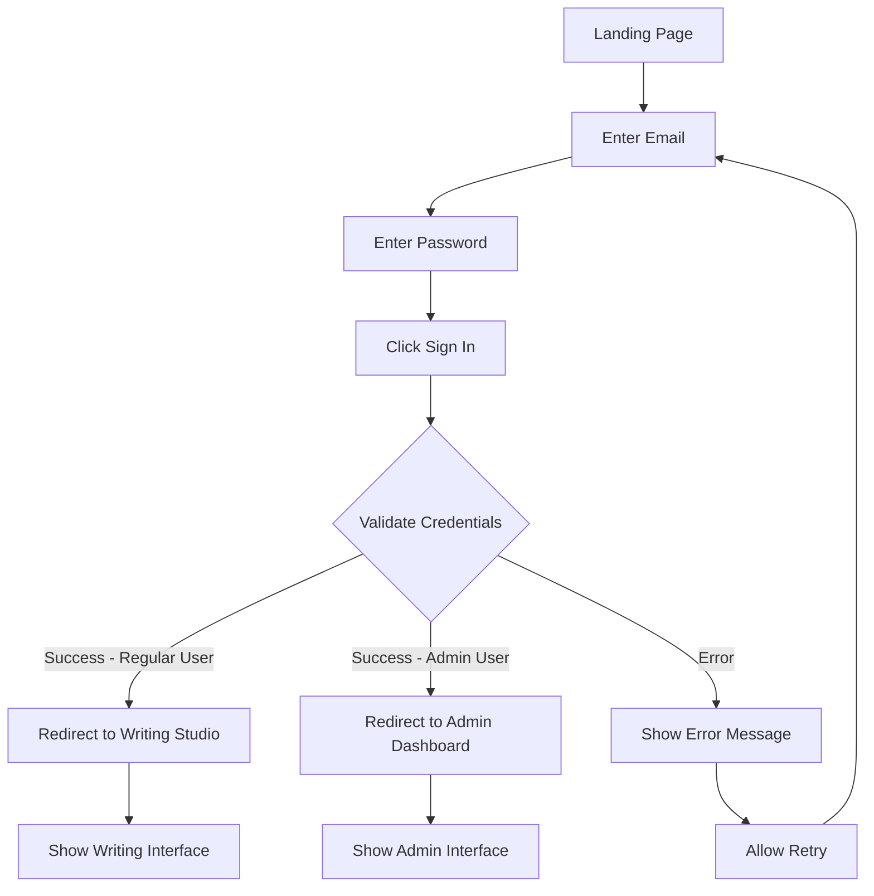
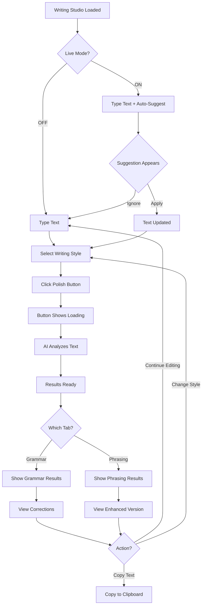
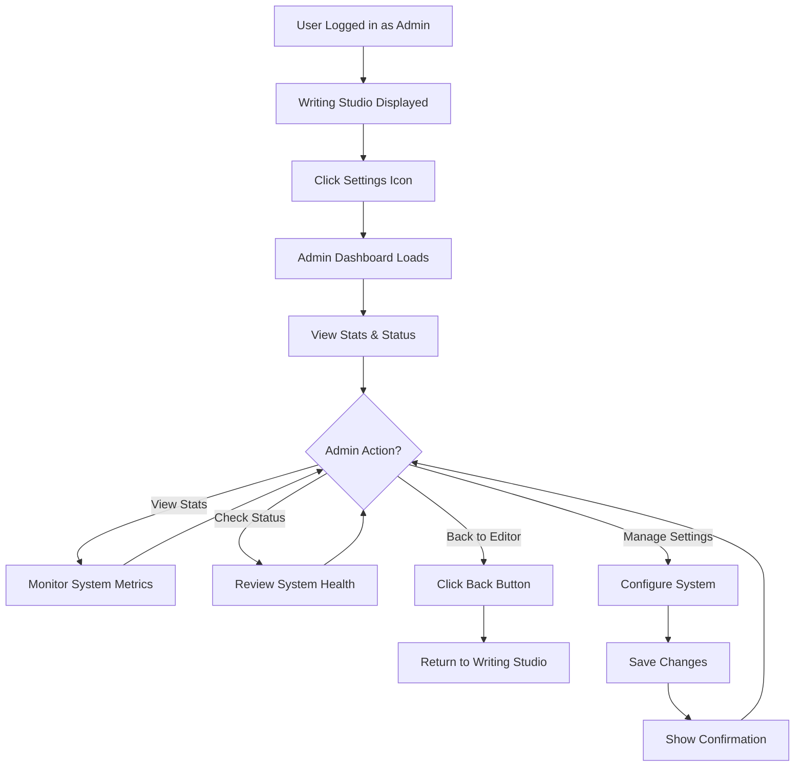
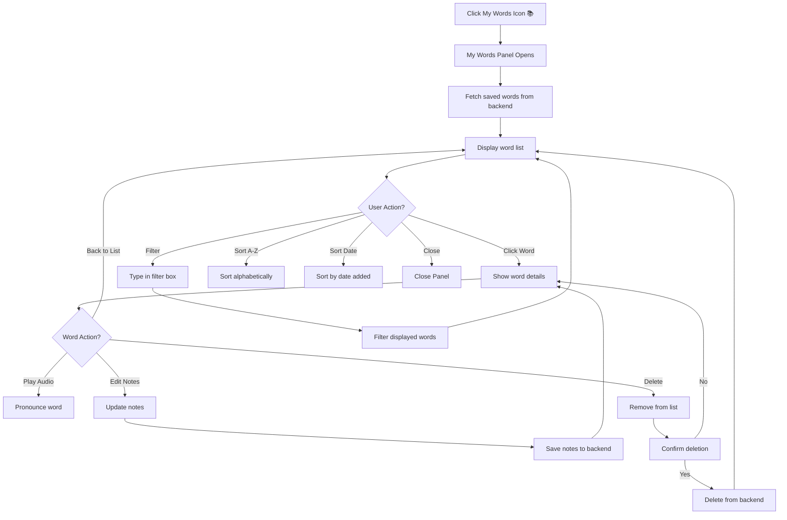
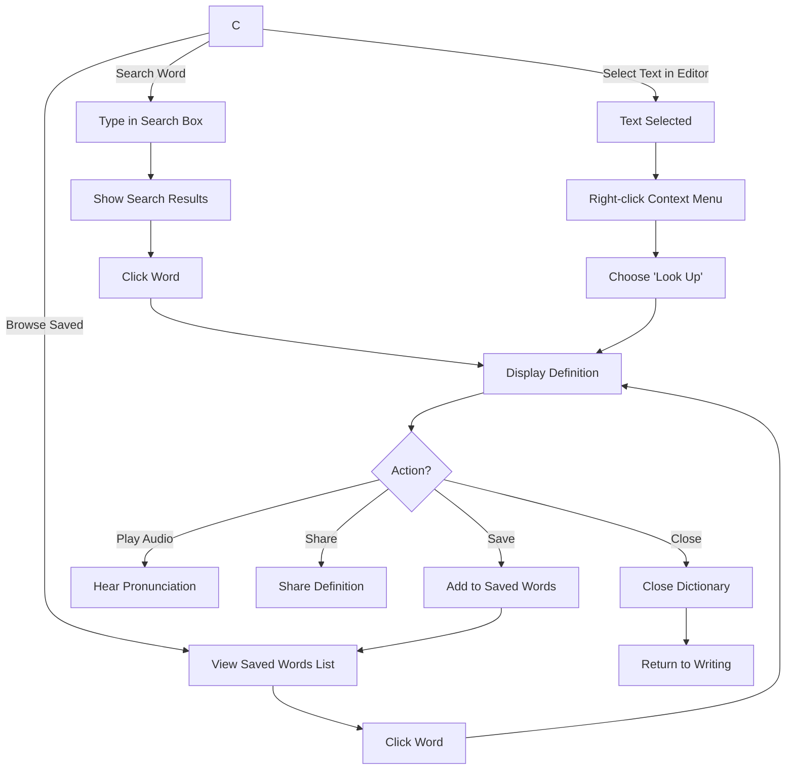
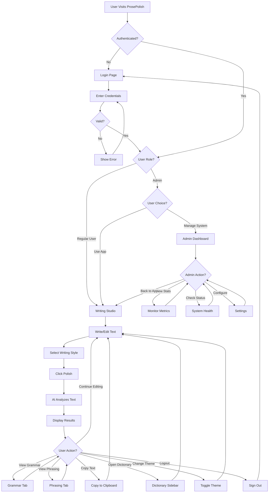
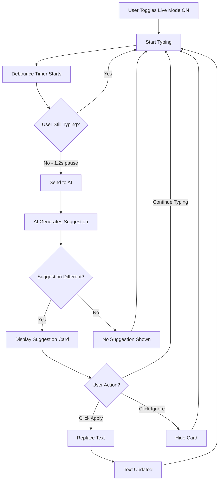
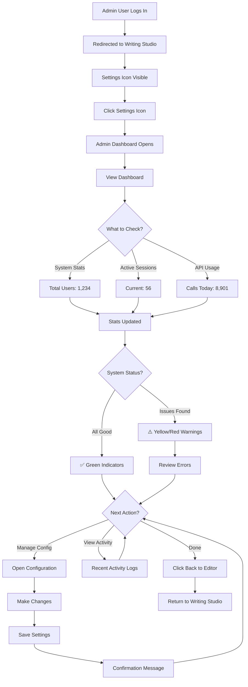
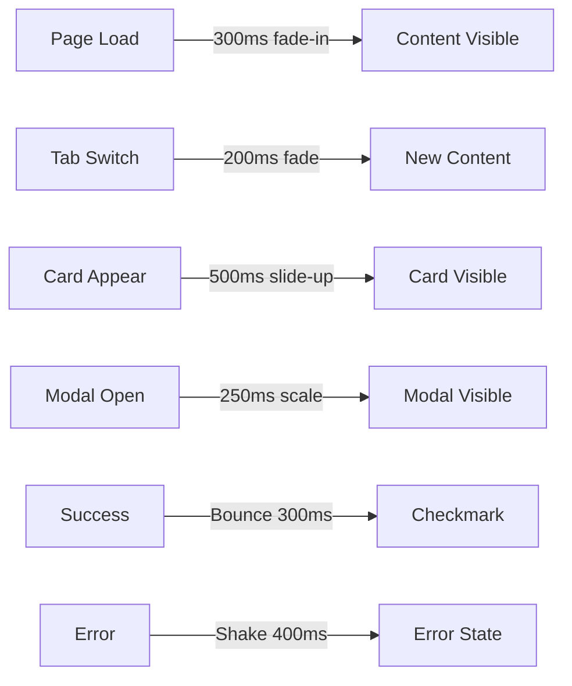

# ProsePolish - UX Design Documentation

> Comprehensive user experience design guide for all pages and interactions in ProsePolish

---

## Table of Contents

1. [Design Philosophy](#design-philosophy)
2. [Design System Overview](#design-system-overview)
3. [Architecture Overview](#architecture-overview)
4. [Page Designs](#page-designs)
   - [Login Page](#1-login-page)
   - [Writing Studio](#2-writing-studio)
   - [Admin Dashboard](#3-admin-dashboard)
   - [Dictionary (Word Lookup)](#4-dictionary-word-lookup)
   - [My Words (Saved Vocabulary)](#5-my-words-saved-vocabulary)
5. [Header Actions Summary](#header-actions-summary)
6. [User Flows](#6-user-flows)
7. [Interaction Patterns](#interaction-patterns)
8. [Responsive Design](#responsive-design)
9. [Accessibility](#accessibility)

---

## Design Philosophy

### Core Principles

**1. Clarity Over Cleverness**

- Clean, intuitive interfaces that don't require explanation
- Clear visual hierarchy guides users naturally
- Information is presented when needed, hidden when not

**2. Progressive Disclosure**

- Show basic features immediately
- Reveal advanced features contextually
- Minimize cognitive load on users

**3. Immediate Feedback**

- Every action provides visual confirmation
- Loading states are clear and informative
- Error messages are helpful, not cryptic

**4. Consistency**

- Unified design language across all pages
- Predictable interaction patterns
- Familiar UI components

---

## Design System Overview

### Color Palette

#### Light Theme

```css
Primary Actions:    #2563eb (Blue)
Primary Hover:      #1d4ed8 (Dark Blue)
Background:         #fafafa (Off-white)
Surface:            #ffffff (White)
Text Primary:       #0f172a (Dark Gray)
Text Secondary:     #64748b (Medium Gray)
Border:             #e2e8f0 (Light Gray)
Success:            #10b981 (Green)
Error:              #ef4444 (Red)
Warning:            #f59e0b (Amber)
```

#### Dark Theme

```css
Primary Actions:    #3b82f6 (Bright Blue)
Primary Hover:      #60a5fa (Lighter Blue)
Background:         #0f172a (Deep Navy)
Surface:            #1e293b (Dark Slate)
Text Primary:       #f1f5f9 (Off-white)
Text Secondary:     #cbd5e1 (Light Gray)
Border:             #334155 (Medium Slate)
```

### Typography

**Font Families:**

- **Sans-serif:** Inter (UI elements, body text)
- **Serif:** Merriweather (Editor, reading content)
- **Monospace:** Roboto Mono (Code, technical)
- **Display:** Playfair Display (Headings, branding)

**Scale:**

- xs: 0.75rem (12px) - Labels, metadata
- sm: 0.875rem (14px) - Secondary text
- base: 1rem (16px) - Body text
- lg: 1.125rem (18px) - Editor text
- xl: 1.25rem (20px) - Section headings
- 2xl: 1.5rem (24px) - Page headings
- 3xl: 1.875rem (30px) - Hero text
- 4xl: 2.25rem (36px) - Display headings

### Spacing System

```css
xs:   0.25rem (4px)   - Tight spacing
sm:   0.5rem (8px)    - Component padding
md:   1rem (16px)     - Standard spacing
lg:   1.5rem (24px)   - Section spacing
xl:   2rem (32px)     - Large sections
2xl:  3rem (48px)     - Page sections
```

### Shadows

```css
sm:   Subtle elevation (cards, buttons)
base: Standard elevation (dropdowns)
md:   Medium elevation (modals, popovers)
lg:   High elevation (dialogs)
xl:   Maximum elevation (overlays)
```

---

## Architecture Overview

### Application Component Structure

```
┌─────────────────────────────────────────────────────────────────────────────┐
│                           ProsePolish Application                           │
│                                                                             │
│  ┌───────────────────────────────────────────────────────────────────────┐  │
│  │                         Redux Store (State)                           │  │
│  │  ┌─────────┐ ┌─────────┐ ┌────────┐ ┌──────────┐ ┌─────────┐          │  │
│  │  │  Auth   │ │Settings │ │ Editor │ │Dictionary│ │Analysis │          │  │
│  │  │  Slice  │ │  Slice  │ │ Slice  │ │  Slice   │ │  Slice  │          │  │
│  │  └────┬────┘ └────┬────┘ └────┬───┘ └────┬─────┘ └────┬────┘          │  │
│  └───────┼───────────┼───────────┼──────────┼────────────┼─────────────┘    │
│          │           │           │          │            │                  │
│  ┌───────┴───────────┴───────────┴──────────┴────────────┴─────────────┐    │
│  │                        UI Components Layer                           │   │
│  │                                                                       │  │
│  │  ┌──────────────┐  ┌──────────────────┐  ┌──────────────┐          │     │
│  │  │    Login     │  │  Writing Studio  │  │    Admin     │          │     │
│  │  │  Component   │  │    Component     │  │  Dashboard   │          │     │
│  │  │              │  │                  │  │              │          │     │
│  │  │  ┌────────┐  │  │  ┌────┐ ┌─────┐  │  │  ┌────────┐  │          │      │
│  │  │  │ Email  │  │  │  │Edit││Outpt││  │  │  │ Stats  │  │          │      │
│  │  │  │ Input  │  │  │  │Panel││Panel││ │  │  │ Cards  │  │          │     │
│  │  │  └────────┘  │  │  └────┘ └─────┘ │  │  └────────┘  │          │      │
│  │  │  ┌────────┐  │  │  ┌────┐ ┌─────┐ │  │  ┌────────┐  │          │      │
│  │  │  │Password│  │  │  │Style││Live │ │  │  │ System │  │          │      │
│  │  │  │ Input  │  │  │  │Pills││Mode │ │  │  │ Status │  │          │      │
│  │  │  └────────┘  │  │  └────┘ └─────┘ │  │  └────────┘  │          │      │
│  │  │  ┌────────┐  │  │                  │  │              │          │     │
│  │  │  │ Submit │  │  │  ┌────────────┐  │  │              │          │     │
│  │  │  │ Button │  │  │  │   Polish   │  │  │              │          │     │
│  │  │  └────────┘  │  │  │   Button   │  │  │              │          │     │
│  │  └──────────────┘  │  └────────────┘  │  └──────────────┘          │     │
│  └───────────────────────────────────────────────────────────────────────┘  │
│                                    │                                        │
│  ┌─────────────────────────────────┴──────────────────────────────────┐     │
│  │                        Services Layer                              │     │
│  │  ┌─────────────────┐  ┌─────────────────┐  ┌──────────────────┐  │       │
│  │  │  Gemini API     │  │  localStorage   │  │  Authentication  │  │       │
│  │  │  Service        │  │  Service        │  │  Service         │  │       │
│  │  └─────────────────┘  └─────────────────┘  └──────────────────┘  │       │
│  └─────────────────────────────────────────────────────────────────────┘    │
└─────────────────────────────────────────────────────────────────────────────┘
```

---

## Page Designs

## 1. Login Page

### Overview

The entry point to ProsePolish - clean, welcoming, and focused on getting users started quickly.

### Layout Structure

```
┌─────────────────────────────────────────────────────────────────────────────┐
│                                                                             │
│                         Full Screen Container                               │
│                      (Centered Vertically & Horizontally)                   │
│                                                                             │
│                    ┌─────────────────────────────┐                          │
│                    │                             │                          │
│                    │    ┌───────────────────┐    │                          │
│                    │    │  ┌─────────────┐  │    │                          │
│                    │    │  │   Gradient  │  │    │  Logo Icon               │
│                    │    │  │   64×64px   │  │    │  (Pen in circle)         │
│                    │    │  │   ✒️ Icon   │  │    │  Blue gradient           │
│                    │    │  └─────────────┘  │    │  Shadow: md              │
│                    │    └───────────────────┘    │                          │
│                    │                             │                          │
│                    │      ProsePolish            │  Title                   │
│                    │   (Playfair Display 30px)   │  Font: Display           │
│                    │                             │  Weight: 700             │
│                    │                             │                          │
│                    │  Polish your writing with AI │  Tagline                 │
│                    │   (Inter 14px, Gray)        │  Font: Sans              │
│                    │                             │  Color: Secondary        │
│                    ├─────────────────────────────┤                          │
│                    │                             │                          │
│                    │  Email                      │  Label                   │
│                    │  ┌─────────────────────────┐│  Font: 14px              │
│                    │  │ user@example.com        ││  Input Field             │
│                    │  │                         ││  Height: 48px            │
│                    │  └─────────────────────────┘│  Border-radius: 12px     │
│                    │                             │  Border: 1px             │
│                    │  Password                   │                          │
│                    │  ┌─────────────────────────┐│                          │
│                    │  │ ••••••••••              ││  Password Input          │
│                    │  │                    👁   ││  Toggle icon             │
│                    │  └─────────────────────────┘│  Show/Hide               │
│                    │                             │                          │
│                    │  ┌─────────────────────────┐│                          │
│                    │  │      Sign In            ││  Primary Button          │
│                    │  │    (Blue Gradient)      ││  Height: 48px            │
│                    │  └─────────────────────────┘│  Full width              │
│                    │                             │  Shadow: lg              │
│                    │                             │  Hover: lift effect      │
│                    │  Don't have an account?     │                          │
│                    │  Sign up                    │  Footer Link             │
│                    │                             │  Link color: Primary     │
│                    └─────────────────────────────┘                          │
│                                                                             │
│                         Card: 420px width                                   │
│                         Padding: 48px                                       │
│                         Background: Surface                                 │
│                         Shadow: lg                                          │
│                         Border-radius: 16px                                 │
│                                                                             │
└─────────────────────────────────────────────────────────────────────────────┘
```

### Visual Design Specifications

**Container:**

- Width: 420px max
- Centered vertically and horizontally
- Background: Surface color with shadow.lg
- Border-radius: xl (1rem/16px)
- Padding: 2xl (48px)

**Logo Section:**

- Icon: Gradient blue circle with pen icon
  - Size: 64px × 64px
  - Gradient: 135deg from #2563eb to #1d4ed8
  - Shadow: md
- Title: "ProsePolish"
  - Font: Playfair Display
  - Size: 3xl (30px)
  - Weight: 700
  - Color: Primary text
  - Margin-bottom: sm (8px)
- Tagline: "Polish your writing with AI"
  - Font: Inter
  - Size: sm (14px)
  - Color: Text secondary
  - Margin-bottom: xl (32px)

**Input Fields:**

- Label:
  - Font-size: sm (14px)
  - Font-weight: 500
  - Color: Text primary
  - Margin-bottom: xs (4px)
- Input:
  - Width: 100%
  - Height: 48px
  - Padding: 12px 16px
  - Border: 1px solid border color
  - Border-radius: lg (12px)
  - Font-size: base (16px)
  - Transition: 200ms ease
- Focus State:
  - Border-color: Primary
  - Box-shadow: 0 0 0 3px primary with 10% opacity
  - Outline: none
- Error State:
  - Border-color: Error
  - Background: Error light
  - Error message below in error color

**Sign In Button:**

- Width: 100%
- Height: 48px
- Background: Linear gradient (135deg, #2563eb to #1d4ed8)
- Color: White
- Font-size: base (16px)
- Font-weight: 600
- Border-radius: lg (12px)
- Shadow: lg
- Margin-top: lg (24px)
- Hover Effect:
  - Transform: translateY(-2px)
  - Shadow: xl with blue tint
- Active Effect:
  - Transform: translateY(0)
- Loading State:
  - Disabled appearance
  - Spinner animation
  - Text: "Signing in..."

**Footer Links:**

- Font-size: sm (14px)
- Color: Text secondary
- Link color: Primary
- Hover: Primary hover
- Margin-top: lg (24px)

### Interaction States

```
┌─────────────────────────────────────────────────────────────────────────┐
│                        Login Page States                                │
├─────────────────────────────────────────────────────────────────────────┤
│                                                                         │
│  1. Default State                                                       │
│     ┌─────────────┐                                                     │
│     │ Empty Form  │                                                     │
│     │ No Errors   │                                                     │
│     │ Button: ON  │                                                     │
│     └─────────────┘                                                     │
│                                                                         │
│  2. Typing State                                                        │
│     ┌─────────────┐                                                     │
│     │ Validation  │  (Real-time, no error until blur)                  │
│     │ On Blur     │                                                     │
│     └─────────────┘                                                     │
│                                                                         │
│  3. Error State                                                         │
│     ┌─────────────────────────┐                                        │
│     │  ❌ Invalid Email        │  Red border                            │
│     │  Error message below    │  Shake animation                       │
│     │  Error icon in input    │  AlertCircle icon                      │
│     └─────────────────────────┘                                        │
│                                                                         │
│  4. Success State                                                       │
│     ┌─────────────────────────┐                                        │
│     │  ✅ Login Successful    │  Green checkmark                       │
│     │  Redirecting...         │  Fade transition                       │
│     │  "Welcome back!"        │  Brief message                         │
│     └─────────────────────────┘                                        │
│                                                                         │
│  5. Loading State                                                       │
│     ┌─────────────────────────┐                                        │
│     │  [Spinner] Signing in.. │  Button disabled                       │
│     │  Form inputs disabled   │  Cursor: not-allowed                   │
│     └─────────────────────────┘                                        │
│                                                                         │
└─────────────────────────────────────────────────────────────────────────┘
```

### User Flow



### Accessibility

- All inputs have proper labels
- Tab order: Email → Password → Sign In → Sign Up Link
- Enter key submits form
- ARIA labels for icons
- Color contrast ratio: 4.5:1 minimum
- Keyboard navigation fully supported
- Screen reader announcements for errors

---

## 2. Writing Studio

### Overview

The main workspace where users write, analyze, and improve their text. Complex but organized layout with clear sections.

### Layout Structure

```
┌─────────────────────────────────────────────────────────────────────────────────────────────────┐
│  ┌───────────────────────────────────────────────────────────────────────────────────────────┐  │
│  │                                      Header (72px)                                        │  │
│  │  ┌─────────────────────────┐                           ┌────────────────────────────────┐ │  │
│  │  │  ┌──┐  ProsePolish      │                           │  [☀️] [⚙️] [📖] [📚] [Sign Out] │ │  │
│  │  │  │✒️│  (Logo + Text)     │                           │  Theme Admin Dict MyWords Exit │ │  │
│  │  │  └──┘                    │                           └────────────────────────────────┘ │  │
│  │  └─────────────────────────┘                                                              │  │
│  └───────────────────────────────────────────────────────────────────────────────────────────┘  │
│                                                                                                  │
│  ┌──────────────────────────────────────────┬──────────────────────────────────────────────────┐│
│  │         Editor Panel (50%)               │          Output Panel (50%)                      ││
│  │                                          │                                                  ││
│  │  ┌────────────────────────────────────┐  │  ┌────────────────────────────────────────────┐ ││
│  │  │   ORIGINAL TEXT      [⚡Live] [✖️]  │  │  │  [✓ Grammar Check] [✨ Better Phrasing]   │ ││
│  │  └────────────────────────────────────┘  │  └────────────────────────────────────────────┘ ││
│  │                                          │                                                  ││
│  │  ┌────────────────────────────────────┐  │  ┌────────────────────────────────────────────┐ ││
│  │  │                                    │  │  │                                            │ ││
│  │  │  ┌──────────────────────────────┐  │  │  │  ┌──────────────────────────────────┐    │ ││
│  │  │  │                              │  │  │  │  │  Original with Issues            │    │ ││
│  │  │  │   Type your text here...     │  │  │  │  │  ┌────────────────────────────┐  │    │ ││
│  │  │  │                              │  │  │  │  │  │ The cat was [very happy] ❌│  │    │ ││
│  │  │  │   [Text Editor Area]         │  │  │  │  │  └────────────────────────────┘  │    │ ││
│  │  │  │                              │  │  │  │  └──────────────────────────────────┘    │ ││
│  │  │  │   Font: 18px                 │  │  │  │                                            │ ││
│  │  │  │   Line-height: 1.8           │  │  │  │  ┌──────────────────────────────────┐    │ ││
│  │  │  │   Padding: 32px              │  │  │  │  │  Corrected Version         [📋]  │    │ ││
│  │  │  │                              │  │  │  │  │  ┌────────────────────────────┐  │    │ ││
│  │  │  │                              │  │  │  │  │  │ The cat was [delighted] ✅ │  │    │ ││
│  │  │  │                              │  │  │  │  │  └────────────────────────────┘  │    │ ││
│  │  │  └──────────────────────────────┘  │  │  │  └──────────────────────────────────┘    │ ││
│  │  │                                    │  │  │                                            │ ││
│  │  │  ┌────────────────────────────┐    │  │  │  ┌──────────────────────────────────┐    │ ││
│  │  │  │ 💡 Live Suggestion         │    │  │  │  │  🏆 IELTS Assessment             │    │ ││
│  │  │  │ "extremely pleased"        │    │  │  │  │  ┌────┐                          │    │ ││
│  │  │  │ [Apply →]                  │    │  │  │  │  │7.5 │ Overall Band             │    │ ││
│  │  │  └────────────────────────────┘    │  │  │  │  └────┘                          │    │ ││
│  │  │  (Amber gradient card)             │  │  │  │  ▓▓▓▓▓▓▓░░ Grammar: 7.5           │    │ ││
│  │  └────────────────────────────────────┘  │  │  │  ▓▓▓▓▓▓▓▓░ Vocabulary: 8.0        │    │ ││
│  │                                          │  │  └──────────────────────────────────┘    │ ││
│  │  ┌────────────────────────────────────┐  │  │                                            │ ││
│  │  │  Style Selection                   │  │  │  ┌──────────────────────────────────┐    │ ││
│  │  │  [Formal][Casual][Technical]       │  │  │  │  📊 Summary                      │    │ ││
│  │  │  [Story][Academic][Blog]           │  │  │  │  Fixed 3 grammatical errors...   │    │ ││
│  │  │  (Pills with icons)                │  │  │  └──────────────────────────────────┘    │ ││
│  │  └────────────────────────────────────┘  │  │                                            │ ││
│  │                                          │  │                                            │ ││
│  │  ┌────────────────────────────────────┐  │  └────────────────────────────────────────────┘ ││
│  │  │  ✨ Polish Writing (formal)        │  │                                                  ││
│  │  │  [Blue Gradient Button]            │  │                                                  ││
│  │  └────────────────────────────────────┘  │                                                  ││
│  └──────────────────────────────────────────┴──────────────────────────────────────────────────┘│
│                                                                                                  │
│  Border: 1px solid border-color                                                                 │
│  Editor Panel Border-right: 1px                                                                 │
│  Output Panel Border-left: None                                                                 │
│                                                                                                  │
└─────────────────────────────────────────────────────────────────────────────────────────────────┘
```

### Component Breakdown

```
┌─────────────────────────────────────────────────────────────────────────┐
│                   Writing Studio Components                            │
├─────────────────────────────────────────────────────────────────────────┤
│                                                                         │
│  ┌───────────────────────────────────────────────────────────────┐    │
│  │                        Header Component                       │    │
│  │  ┌──────────┐  ┌─────────┐  ┌─────────┐  ┌──────────┐       │    │
│  │  │   Logo   │  │  Theme  │  │Settings │  │Dictionary│       │    │
│  │  │  Section │  │  Toggle │  │  (Admin)│  │  Button  │       │    │
│  │  └──────────┘  └─────────┘  └─────────┘  └──────────┘       │    │
│  │                                          ┌──────────┐       │    │
│  │                                          │ My Words │       │    │
│  │                                          │  Button  │       │    │
│  │                                          └──────────┘       │    │
│  └───────────────────────────────────────────────────────────────┘    │
│                                                                         │
│  ┌────────────────────────┐  ┌────────────────────────────────┐       │
│  │   Editor Panel         │  │   Output Panel                 │       │
│  │  ┌──────────────────┐  │  │  ┌──────────────────────────┐  │       │
│  │  │  Panel Header    │  │  │  │  Tab Navigation          │  │       │
│  │  │  - Label         │  │  │  │  - Grammar Tab           │  │       │
│  │  │  - Live Toggle   │  │  │  │  - Phrasing Tab          │  │       │
│  │  │  - Clear Button  │  │  │  └──────────────────────────┘  │       │
│  │  └──────────────────┘  │  │                                │       │
│  │                        │  │  ┌──────────────────────────┐  │       │
│  │  ┌──────────────────┐  │  │  │  Content Area            │  │       │
│  │  │  Text Editor     │  │  │  │  - Empty State           │  │       │
│  │  │  - 18px font     │  │  │  │  - Result Cards          │  │       │
│  │  │  - 1.8 line-h    │  │  │  │  - IELTS Card            │  │       │
│  │  │  - Scrollable    │  │  │  │  - Info Cards            │  │       │
│  │  └──────────────────┘  │  │  └──────────────────────────┘  │       │
│  │                        │  │                                │       │
│  │  ┌──────────────────┐  │  │                                │       │
│  │  │ Live Suggestion  │  │  │                                │       │
│  │  │ Card (floating)  │  │  │                                │       │
│  │  └──────────────────┘  │  │                                │       │
│  │                        │  │                                │       │
│  │  ┌──────────────────┐  │  │                                │       │
│  │  │  Footer          │  │  │                                │       │
│  │  │  - Style Pills   │  │  │                                │       │
│  │  │  - Polish Button │  │  │                                │       │
│  │  └──────────────────┘  │  │                                │       │
│  └────────────────────────┘  └────────────────────────────────┘       │
│                                                                         │
└─────────────────────────────────────────────────────────────────────────┘
```

### User Flow



### Accessibility

- Keyboard shortcuts:
  - Ctrl/Cmd + Enter: Analyze
  - Ctrl/Cmd + L: Toggle live mode
  - Ctrl/Cmd + K: Clear text
- Focus indicators on all interactive elements
- ARIA labels for icon buttons
- Skip links for keyboard navigation
- High contrast mode support
- Screen reader announcements for analysis results

---

## 3. Admin Dashboard

### Overview

Control center for administrators to monitor system health, manage users, and configure settings.

### Layout Structure

```
┌─────────────────────────────────────────────────────────────────────────────┐
│  ┌─────────────────────────────────────────────────────────────────────────┐│
│  │                          Header (80px)                                   ││
│  │  Admin Dashboard                                    [Back to Editor]     ││
│  │  (Font: 2xl, Weight: 600, Color: Primary)          (Primary Button)     ││
│  └─────────────────────────────────────────────────────────────────────────┘│
│                                                                              │
│  ┌───────────────────────┬────────────────────────┬─────────────────────┐   │
│  │   Stat Card 1         │   Stat Card 2          │   Stat Card 3       │   │
│  │  ┌─────────────────┐  │  ┌──────────────────┐  │  ┌────────────────┐ │   │
│  │  │  Total Users    │  │  │  Active Sessions │  │  │ API Calls Today│ │   │
│  │  │                 │  │  │                  │  │  │                │ │   │
│  │  │     1,234       │  │  │       56         │  │  │     8,901      │ │   │
│  │  │  (4xl, Bold)    │  │  │   (4xl, Bold)    │  │  │  (4xl, Bold)   │ │   │
│  │  │  (Primary)      │  │  │   (Primary)      │  │  │  (Primary)     │ │   │
│  │  └─────────────────┘  │  └──────────────────┘  │  └────────────────┘ │   │
│  │  Background: Surface  │  Background: Surface   │  Background: Surface│   │
│  │  Border: 1px          │  Border: 1px           │  Border: 1px        │   │
│  │  Padding: 32px        │  Padding: 32px         │  Padding: 32px      │   │
│  │  Border-radius: lg    │  Border-radius: lg     │  Border-radius: lg  │   │
│  └───────────────────────┴────────────────────────┴─────────────────────┘   │
│                                                                              │
│  ┌─────────────────────────────────────────────────────────────────────┐    │
│  │                        System Status                                │    │
│  │  ┌───────────────────────────────────────────────────────────────┐  │    │
│  │  │  ✅ All systems operational                                   │  │    │
│  │  │  ✅ AI models responding normally                             │  │    │
│  │  │  ✅ Database connection stable                                │  │    │
│  │  └───────────────────────────────────────────────────────────────┘  │    │
│  │  Background: Surface                                                │    │
│  │  Border: 1px, Padding: 32px, Border-radius: lg                     │    │
│  └─────────────────────────────────────────────────────────────────────┘    │
│                                                                              │
│  ┌─────────────────────────────────────────────────────────────────────┐    │
│  │                        Recent Activity                              │    │
│  │  ┌───────────────────────────────────────────────────────────────┐  │    │
│  │  │  This section would display recent user activity, system      │  │    │
│  │  │  logs, and analytics.                                         │  │    │
│  │  │                                                               │  │    │
│  │  │  • User john@example.com logged in - 2 min ago               │  │    │
│  │  │  • Analysis completed for document #1234 - 5 min ago         │  │    │
│  │  │  • System backup completed - 1 hour ago                      │  │    │
│  │  └───────────────────────────────────────────────────────────────┘  │    │
│  └─────────────────────────────────────────────────────────────────────┘    │
│                                                                              │
│  ┌─────────────────────────────────────────────────────────────────────┐    │
│  │                        Configuration                                │    │
│  │  ┌───────────────────────────────────────────────────────────────┐  │    │
│  │  │  Admin settings and configuration options would be available  │  │    │
│  │  │  here.                                                        │  │    │
│  │  │                                                               │  │    │
│  │  │  [API Settings] [Feature Flags] [User Management]            │  │    │
│  │  └───────────────────────────────────────────────────────────────┘  │    │
│  └─────────────────────────────────────────────────────────────────────┘    │
│                                                                              │
└─────────────────────────────────────────────────────────────────────────────┘
```

### User Flow



---

## 4. Dictionary (Word Lookup)

### Overview

A focused word lookup tool for searching and viewing word definitions. Accessed via the Dictionary icon (📖) in the header. This is separate from "My Words" which manages saved vocabulary.

### Planned Layout

```
┌─────────────────────────────────────────────────────────────────────────┐
│  ┌───────────────────────────────────────────────────────────────────┐  │
│  │  Dictionary                                              [×]      │  │
│  │  Width: 400px | Position: Right overlay                          │  │
│  └───────────────────────────────────────────────────────────────────┘  │
│                                                                         │
│  ┌───────────────────────────────────────────────────────────────────┐  │
│  │  Search                                                           │  │
│  │  ┌─────────────────────────────────────────────────────────────┐  │  │
│  │  │  🔍  Search for a word... (Press Enter)                     │  │  │
│  │  └─────────────────────────────────────────────────────────────┘  │  │
│  └───────────────────────────────────────────────────────────────────┘  │
│                                                                         │
│  ┌───────────────────────────────────────────────────────────────────┐  │
│  │  Word Details                                             [🔊]   │  │
│  │  ┌─────────────────────────────────────────────────────────────┐  │  │
│  │  │  eloquent                                                   │  │  │
│  │  │  /ˈɛləkwənt/                          (adjective)          │  │  │
│  │  │                                                             │  │  │
│  │  │  Definition:                                                │  │  │
│  │  │  Fluent or persuasive in speaking or writing               │  │  │
│  │  │                                                             │  │  │
│  │  │  Example:                                                   │  │  │
│  │  │  "an eloquent speech about civil rights"                   │  │  │
│  │  │                                                             │  │  │
│  │  │  Synonyms:                                                  │  │  │
│  │  │  articulate, fluent, expressive, persuasive                │  │  │
│  │  │                                                             │  │  │
│  │  │  [💾 Save to My Words]                                      │  │  │
│  │  └─────────────────────────────────────────────────────────────┘  │  │
│  └───────────────────────────────────────────────────────────────────┘  │
│                                                                         │
│  ┌───────────────────────────────────────────────────────────────────┐  │
│  │  Recent Lookups                                                   │  │
│  │  ┌─────────────────────────────────────────────────────────────┐  │  │
│  │  │  • eloquent                                                 │  │  │
│  │  │  • ubiquitous                                               │  │  │
│  │  │  • paradigm                                                 │  │  │
│  │  └─────────────────────────────────────────────────────────────┘  │  │
│  │  (Last 10 lookups, stored in session)                             │  │
│  └───────────────────────────────────────────────────────────────────┘  │
│                                                                         │
└─────────────────────────────────────────────────────────────────────────┘
```

### Dictionary User Flow

```mermaid
graph TD
    A[Click Dictionary Icon 📖] --> B[Dictionary Panel Opens]
    B --> C[Type word in search]
    C --> D[Press Enter]
    D --> E[Fetch definition from API]
    E --> F{Definition found?}
    F -->|Yes| G[Display word details]
    F -->|No| H[Show "Word not found"]
    G --> I{User Action?}
    I -->|Save to My Words| J[Add to saved words]
    I -->|Play Audio| K[Pronounce word]
    I -->|Search Another| C
    I -->|Close| L[Close Panel]
    J --> M[Show success toast]
    M --> G
```

---

## 5. My Words (Saved Vocabulary)

### Overview

Personal vocabulary management panel for viewing, organizing, and reviewing saved words. Accessed via the My Words icon (📚) in the header. Words are saved from Dictionary lookups or from text analysis suggestions.

### Planned Layout

```
┌─────────────────────────────────────────────────────────────────────────┐
│  ┌───────────────────────────────────────────────────────────────────┐  │
│  │  My Words                                                [×]      │  │
│  │  Width: 400px | Position: Right overlay                          │  │
│  └───────────────────────────────────────────────────────────────────┘  │
│                                                                         │
│  ┌───────────────────────────────────────────────────────────────────┐  │
│  │  Filter                                                           │  │
│  │  ┌─────────────────────────────────────────────────────────────┐  │  │
│  │  │  🔍  Filter saved words...                                  │  │  │
│  │  └─────────────────────────────────────────────────────────────┘  │  │
│  └───────────────────────────────────────────────────────────────────┘  │
│                                                                         │
│  ┌───────────────────────────────────────────────────────────────────┐  │
│  │  Saved Words (42)                                     [A-Z] [Date]│  │
│  │  ┌─────────────────────────────────────────────────────────────┐  │  │
│  │  │  • eloquent           adjective              [🔊] [🗑️]      │  │  │
│  │  │  • ubiquitous         adjective              [🔊] [🗑️]      │  │  │
│  │  │  • paradigm           noun                   [🔊] [🗑️]      │  │  │
│  │  │  • serendipity        noun                   [🔊] [🗑️]      │  │  │
│  │  │  • ephemeral          adjective              [🔊] [🗑️]      │  │  │
│  │  │  • hitting the big 3-0  idiom                [🔊] [🗑️]      │  │  │
│  │  └─────────────────────────────────────────────────────────────┘  │  │
│  │  (Scrollable list, persisted to database)                         │  │
│  └───────────────────────────────────────────────────────────────────┘  │
│                                                                         │
│  ┌───────────────────────────────────────────────────────────────────┐  │
│  │  Word Details (when selected)                             [🔊]   │  │
│  │  ┌─────────────────────────────────────────────────────────────┐  │  │
│  │  │  eloquent                                                   │  │  │
│  │  │  /ˈɛləkwənt/                          (adjective)          │  │  │
│  │  │                                                             │  │  │
│  │  │  Definition:                                                │  │  │
│  │  │  Fluent or persuasive in speaking or writing               │  │  │
│  │  │                                                             │  │  │
│  │  │  Example:                                                   │  │  │
│  │  │  "an eloquent speech about civil rights"                   │  │  │
│  │  │                                                             │  │  │
│  │  │  Synonyms:                                                  │  │  │
│  │  │  articulate, fluent, expressive, persuasive                │  │  │
│  │  │                                                             │  │  │
│  │  │  Notes: (editable)                                         │  │  │
│  │  │  ┌───────────────────────────────────────────────────────┐ │  │  │
│  │  │  │ Used in IELTS essay about leadership                  │ │  │  │
│  │  │  └───────────────────────────────────────────────────────┘ │  │  │
│  │  │                                                             │  │  │
│  │  │  Added: Dec 6, 2025                                        │  │  │
│  │  └─────────────────────────────────────────────────────────────┘  │  │
│  └───────────────────────────────────────────────────────────────────┘  │
│                                                                         │
└─────────────────────────────────────────────────────────────────────────┘
```

### My Words User Flow



---

## Header Actions Summary

### Icon Buttons in Header (Left to Right)

| Icon | Name | Action | Description |
|------|------|--------|-------------|
| ☀️/🌙 | Theme Toggle | Toggle light/dark mode | Switches application theme |
| ⚙️ | Settings | Open Admin Dashboard | Only visible for admin users |
| 📖 | Dictionary | Open Dictionary Panel | Look up word definitions |
| 📚 | My Words | Open My Words Panel | View saved vocabulary |
| Sign Out | Logout Button | End session | Log out of application |

### Key Differences: Dictionary vs My Words

| Feature | Dictionary (📖) | My Words (📚) |
|---------|-----------------|---------------|
| Purpose | Look up word meanings | Manage saved vocabulary |
| Data Source | External API (FreeDictionary/Gemini) | User's database |
| Persistence | Session only (recent lookups) | Permanent (database) |
| Main Action | Search & lookup | Browse & review |
| Save Action | "Save to My Words" button | Already saved |
| Delete Action | N/A | Remove from collection |
| Notes | N/A | Editable personal notes |

---

## 6. User Flows



---

## User Flows

### Complete Application Flow



### Live Mode Interaction Flow



### Admin Workflow



---

## Interaction Patterns

### Micro-interactions

```
┌─────────────────────────────────────────────────────────────────────────┐
│                      Button Interaction States                          │
├─────────────────────────────────────────────────────────────────────────┤
│                                                                         │
│  Default State:                                                         │
│  ┌──────────────┐                                                       │
│  │   Button     │  Scale: 1.0                                          │
│  └──────────────┘  Shadow: base                                        │
│                    Cursor: pointer                                      │
│                                                                         │
│  Hover State (200ms ease):                                             │
│  ┌──────────────┐                                                       │
│  │   Button     │  Scale: 1.02                                         │
│  └──────────────┘  Shadow: lg                                          │
│      ↑ 2px        Transform: translateY(-2px)                          │
│                    Color: Shift to hover color                          │
│                                                                         │
│  Active/Click State (150ms ease):                                      │
│  ┌──────────────┐                                                       │
│  │   Button     │  Scale: 0.98                                         │
│  └──────────────┘  Shadow: sm                                          │
│                    Transform: translateY(0)                             │
│                    Ripple effect (optional)                             │
│                                                                         │
│  Loading State:                                                         │
│  ┌──────────────┐                                                       │
│  │ [⟳] Loading │  Spinner rotation: 360deg                             │
│  └──────────────┘  Disabled: true                                      │
│                    Opacity: 0.6                                         │
│                    Cursor: not-allowed                                  │
│                                                                         │
│  Disabled State:                                                        │
│  ┌──────────────┐                                                       │
│  │   Button     │  Opacity: 0.5                                        │
│  └──────────────┘  Cursor: not-allowed                                 │
│                    No hover effects                                     │
│                                                                         │
└─────────────────────────────────────────────────────────────────────────┘
```

### Transitions & Animations



---

## Responsive Design

### Breakpoints

```
Mobile (Small):     320px - 639px
Mobile (Large):     640px - 767px
Tablet:             768px - 1023px
Desktop (Small):    1024px - 1279px
Desktop (Large):    1280px - 1535px
Desktop (XL):       1536px+
```

### Adaptive Layouts

#### Mobile Layout (< 768px)

```
┌────────────────────────┐
│   [☰] ProsePolish  [⚙️] │  Compact Header
├────────────────────────┤
│  [Editor] [Output]     │  Tabs
├────────────────────────┤
│                        │
│  Active Panel Content  │  Stacked Panels
│  (Editor OR Output)    │  One at a time
│                        │
│                        │
├────────────────────────┤
│  [✨ Polish Writing]   │  Bottom Bar
│  [Style: Formal ▼]     │  Fixed Position
└────────────────────────┘
```

#### Tablet Layout (768px - 1023px)

```
┌────────────────────────────────────┐
│  ProsePolish    [☀️] [⚙️] [📖] [↪]  │
├─────────────────┬──────────────────┤
│   Editor Panel  │  Output Panel    │
│   (60%)         │  (40%)           │
│                 │                  │
│  [Text Area]    │  [Results]       │
│                 │                  │
│                 │                  │
│  [Styles]       │  [Tabs]          │
│  [Polish]       │                  │
└─────────────────┴──────────────────┘
```

#### Desktop Layout (1024px+)

```
┌──────────────────────────────────────────────────────────┐
│  ProsePolish        [☀️] [⚙️] [📖] [Sign Out]            │
├────────────────────────────┬─────────────────────────────┤
│     Editor Panel (50%)     │   Output Panel (50%)        │
│                            │                             │
│  [ORIGINAL TEXT] [⚡] [✖️]  │  [✓ Grammar] [✨ Phrasing]  │
│                            │                             │
│  ┌──────────────────────┐  │  ┌───────────────────────┐  │
│  │                      │  │  │                       │  │
│  │   Text Editor        │  │  │   Results Display     │  │
│  │   Large font         │  │  │   Full details        │  │
│  │   Comfortable        │  │  │   All cards visible   │  │
│  │                      │  │  │                       │  │
│  └──────────────────────┘  │  └───────────────────────┘  │
│                            │                             │
│  [Formal][Casual][Tech]    │                             │
│  [✨ Polish Writing]        │                             │
└────────────────────────────┴─────────────────────────────┘
```

---

## Accessibility

### WCAG 2.1 Level AA Compliance

```
┌─────────────────────────────────────────────────────────────────┐
│                    Accessibility Features                       │
├─────────────────────────────────────────────────────────────────┤
│                                                                 │
│  ✓ Perceivable                                                  │
│    • Text alternatives for all images                           │
│    • Color contrast: 4.5:1 (text), 3:1 (UI)                    │
│    • Text resizable up to 200%                                  │
│    • No information by color alone                              │
│                                                                 │
│  ✓ Operable                                                     │
│    • Full keyboard navigation                                   │
│    • No keyboard traps                                          │
│    • Skip navigation links                                      │
│    • Adequate interaction time                                  │
│                                                                 │
│  ✓ Understandable                                               │
│    • Plain language                                             │
│    • Predictable navigation                                     │
│    • Input assistance                                           │
│    • Error identification & suggestions                         │
│                                                                 │
│  ✓ Robust                                                       │
│    • Valid semantic HTML                                        │
│    • ARIA landmarks                                             │
│    • Compatible with assistive tech                             │
│    • Progressive enhancement                                    │
│                                                                 │
└─────────────────────────────────────────────────────────────────┘
```

### Keyboard Shortcuts

```
Global Shortcuts:
  Ctrl/Cmd + K     : Search/Dictionary
  Ctrl/Cmd + L     : Toggle Live Mode
  Ctrl/Cmd + Enter : Analyze Text
  Ctrl/Cmd + /     : Show shortcuts help
  Esc              : Close modals/dialogs
  Tab              : Navigate forward
  Shift + Tab      : Navigate backward
```

---

## Design Tokens

### Exported Constants

```typescript
export const tokens = {
  colors: {
    primary: '#2563eb',
    primaryHover: '#1d4ed8',
    // ... (full palette)
  },
  spacing: {
    xs: '0.25rem',
    sm: '0.5rem',
    // ... (full scale)
  },
  typography: {
    fontFamily: {
      sans: "'Inter', sans-serif",
      // ...
    },
    fontSize: {
      xs: '0.75rem',
      // ...
    },
  },
  shadows: {
    sm: '0 1px 2px 0 rgb(0 0 0 / 0.05)',
    // ...
  },
  borderRadius: {
    sm: '0.375rem',
    // ...
  },
  transitions: {
    fast: '150ms ease',
    base: '200ms ease',
    slow: '300ms ease',
  },
};
```

---

## Conclusion

This UX design document serves as the single source of truth for ProsePolish's user interface. All implementations should reference this guide to maintain consistency and quality across the application.

**Key Principles to Remember:**

- User needs come first
- Consistency breeds familiarity
- Accessibility is not optional
- Performance impacts experience
- Design is never finished

---

**Document Version:** 2.0
**Last Updated:** 2025-11-29
**Maintained By:** ProsePolish Design Team
